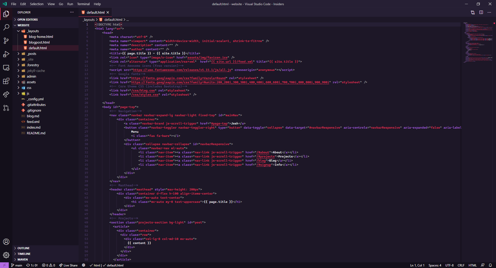
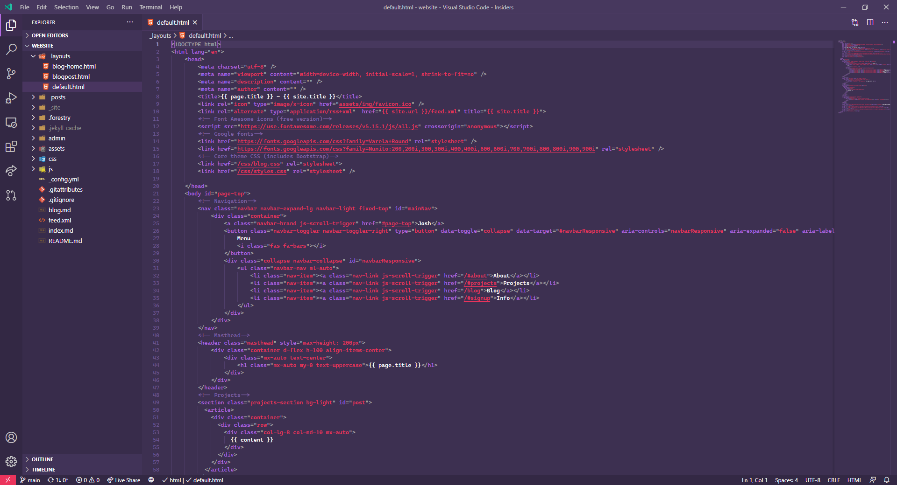
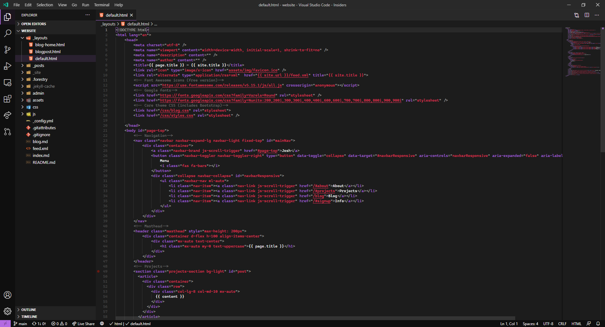

# Functional Programming theme for VS Code

This is a collection of 3 very hastily created themes for VS Code based on the colour scheme of the CS141 Functional Programming module.

## Screenshots

### Functional Programming (Default)

### Functional Programming (Lighter)

### Functional Programming (Darker)

## Install instructions

1. Clone this repository into `%USERPROFILE%\.vscode\extensions` on Windows or `~/.vscode/extensions` on MacOS or Linux.
2. Reload your VS Code window (`Crtl+Shift+P` to open the Command Pallette, type in `Reload Window` then press Enter.)
3. Click on Settings in the bottom-right corner, then "Colour Theme". You should see "Functional Programming" as an option under "Dark Themes", along with the other 2 options "Functional Programming (Lighter)" and "Functional Programming (Darker)".

I'm currently (16/01) investigating uploading this to VSCode Marketplace, but we will see...

## Acknowledgements

Logo taken from screenshot of CS141 Functional Programming material, credit to Michael Gale (https://github.com/mbg)